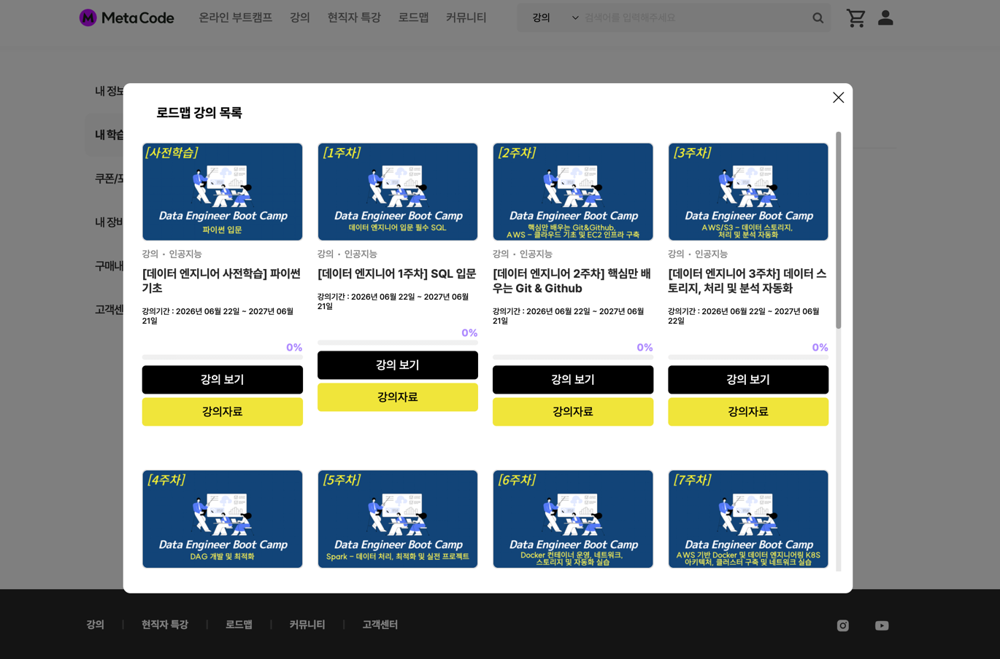
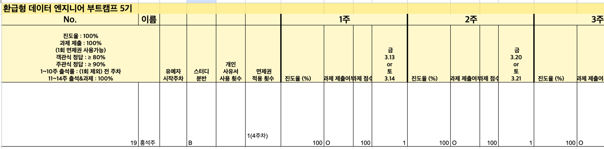
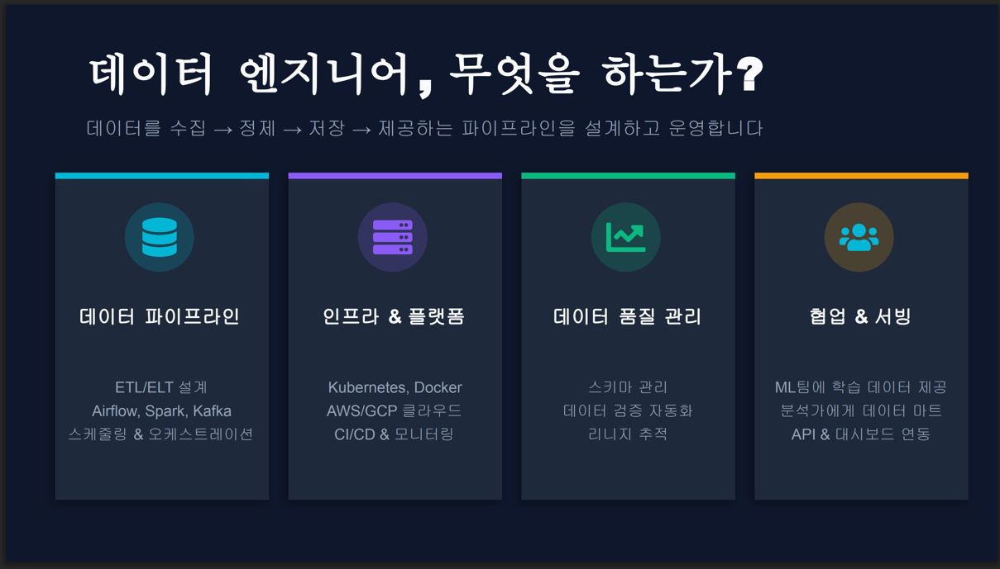
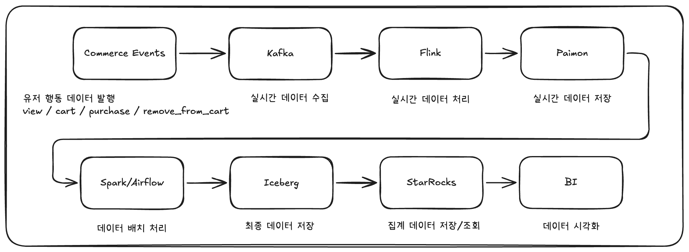
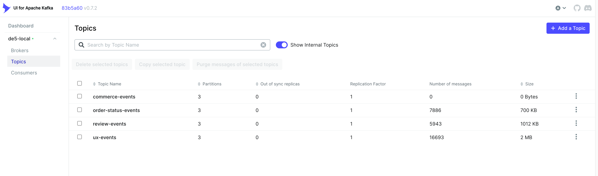
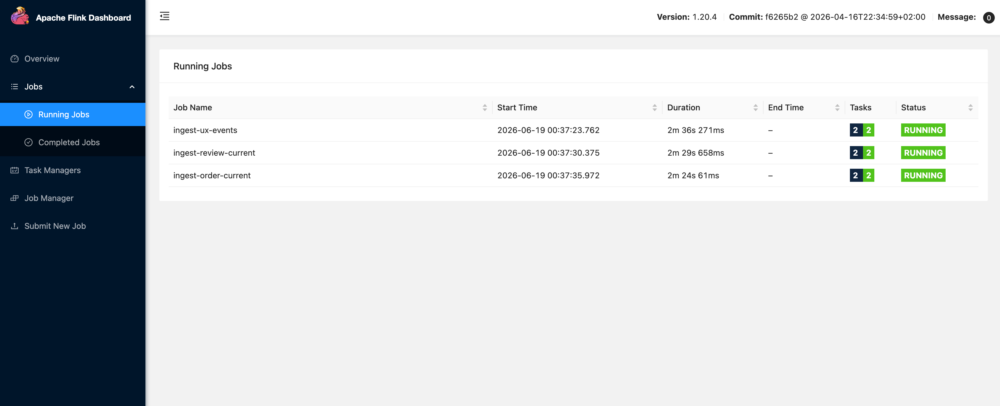
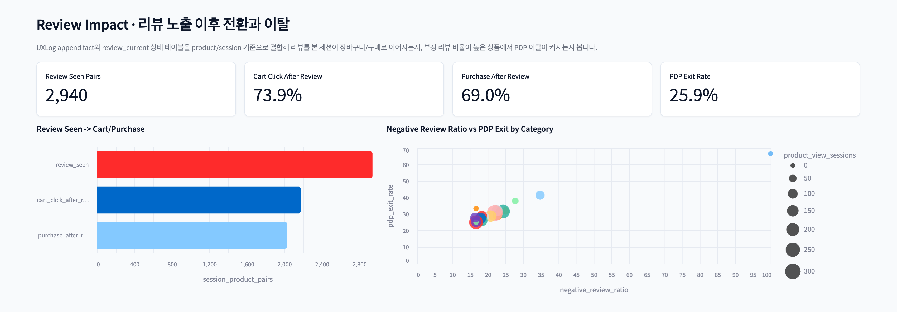

## 내 상황과 고민

- 스타트업에서 2년간 백엔드 개발자로 일하면서 다양한 업무함.
- 사람이 없고 프론트, 백, 인프라, 데이터 안가리고 했음
- 그 중 데이터 플랫폼 구축과 데이터 파이프라인 개발 같은 데이터 관련 업무를 더 맡게 되었다.
- spark, airflow, iceberg 같은 것들로 플랫폼을 구축했는데 java/spring만 사용하던 나에겐 다 처음 사용하고, 어려웠다
- 어찌저찌 구축은 했는데 이게 잘 구축한건지 항상 의심이 들었다.
- 회사 내에서는 데이터 관련해서 물어볼 사람이 없어서 고민이 더 커졌다
- 이를 해결하기 위해 메타코드 부트캠프 수강을 하기로 했다.

## 부트캠프를 선택한 이유

- 내 고민이 현재 내가 직장에서 구축한 데이터 플랫폼과 파이프라인이 잘한 것인지이기 때문에 실무에서 데이터 엔지니어는 어떻게 데이터 파이프라인을 개발하는지, 다른 회사의 데이터 플랫폼은 어떻게 되어있는지가 제일 궁금한데 메타코드 부트캠프에 실무자 특강과 Q&A 세션이 있고, 현직 데이터 엔지니어와 스터디 시간도 이러한 실무에 대해 물어볼 수 있는 사람과 시간이 생긴다는게 선택의 가장 큰 이유
- 제공되는 강의도 Spark, Airflow, k8s, AWS 등 현재 회사에서 내가 구축한 플랫폼과 기술스택이 대부분 겹치고 전반적인 기초를 쌓을 수 있을 것 같은 것도 좋았다.
- 직장 재직중이므로 커리큘럼의 스케줄이 참여가능한지도 중요했는데, 강의와 과제는 일주일내로 자유롭게 하면 된다는점, 라이브 특강이나 스터디의 경우 평일 밤이나 주말에 진행되어 재직중이더라도 참여할 수 있다는 점도 선택 이유
- 출석, 강의 수강이나 과제, 스터디를 잘 수행한다면 비용이 환급이 된다는 점

## 부트캠프 활동 내용
### 1. 강의 수강

### 2. 과제 수행

- 위 사진처럼 매주 강의 진도율, 과제 제출 및 점수가 기재된다.
- 과제는 그 주에 수강한 강의내용을 토대로 퀴즈나 미션이 주어진다
- 퀴즈와 과제는 채점 대상이고 채점된 점수는 환급 여부에 영향이 간다. 그래도 강의를 잘듣고 퀴즈와 과제를 꼼꼼히 푼다면 풀 수 있는 문제들이다.

### 3. 현직 데이터 엔지니어와 라이브 특강

- 현직 데이터 엔지니어분들께서 다양한 주제로 특강을 해주신다.
- 특강 참여가 필수는 아니지만 꼭 듣는 것 추천
- 데이터 엔지니어링에 대한 시야가 더 넓어진 것 같다.
- 특강 마지막 Q&A 시간을 활용해서 평소에 데이터 엔지니어링에 대해 궁금했던점이나 실무에서는 어떻게 하는지 등 평소 궁금했던 점을 질문해서 좋았다.
- 특강은 다음과 같은 주제들로 진행이 됐었다.
  - 데이터 엔지니어 직무 & 커리어 특강
  - 규모에 따라 진화하는 데이터 아키텍처
  - 파이프라인 로드테스트
  - Kafka를 활용한 실시간 데이터, 배치 데이터 개선

### 4. 현직 데이터 엔지니어와 라이브 스터디

- 나는 이 시간이 메타코드 부트캠프를 진행하면서 가장 좋았던 시간이었다.
- 현직 데이터 엔지니어 멘토님과 4주간 매주 2회 특정 주제를 가지고 zoom으로 스터디를 진행한다.
- 스터디는 데이터의 수집, 정제, 처리, BI까지 실시간 데이터 파이프라인 아키텍처를 그려놓고 매 시간마다 한 단계씩 함께 구현하는 방식으로 진행됐다.
- 이 과정 중에서 각 단계마다 "왜 이 기술을 선택했는지", "주의할 점은 무엇인지", "여기에서 장애가 나면 어떻게 복구할 것인지", "데이터는 잘 수집이 되고 있는지" 등 정말 실무적인 관점에서 데이터 엔지니어는 이런 것도 고민해야하구나 하고 알 수 있는 시간이었다.
- 특히 현재 회사에서 데이터 수집에 대한 모니터링(신선도, DQ)등은 해본적이 없는데 배워서 시야가 넓어져서 구현을 하기로 마음먹었다.
- 그리고 스터디 마지막에는 오프라인으로 만나서 만들었던 스터디 주제로 각자 발표를 하는 시간도 갖는다.
- 이때 발표 자료는 멘토님께서 꾸준히 첨삭해주셔서 추후 포트폴리오로도 활용 가능할 정도로 퀄리티가 나오는 것 같다.

## 추천하고 싶은 이유

- 데이터 엔지니어링 관련 교육은 다른 개발 직군보다 적다.
- 특히 직장이나 학교를 병행하면서 할 수 있는 교육은 더 그렇다.
- 직장 다니면서 부트캠프 참여하는게 힘들긴 했지만 돌아보면 남는게 더 많은 것 같다.
- 환급도 출석, 과제 등을 조금만 꼼꼼히 챙기면 환급 받을 수 있다. 나도 직장 다니면서 받았고 덕분에 금전적인 부담도 덜었다. 
- 또 현업 데이터 엔지니어분과 이야기를 할 수 있는 기회가 생긴다는 것만으로 부트캠프 참여 이유로 충분하다.
- 우수 수료생 되면 멘토님한테 이력서, 자소서, 포트폴리오도 첨삭해준다고 하니 데이터 엔지니어로 취직이나 이직하려는 사람들에게도 추천한다.

## 마무리

<이거는 위에 내용 보고 작성해줘>

메타코드 사이트: <https://www.metacodes.co.kr/>

해시태그: #메타코드부트캠프 #부트캠프 #메타코드 #데이터엔지니어 #AWS #Airflow #Spark #Docker #Kubernets #Kafka
