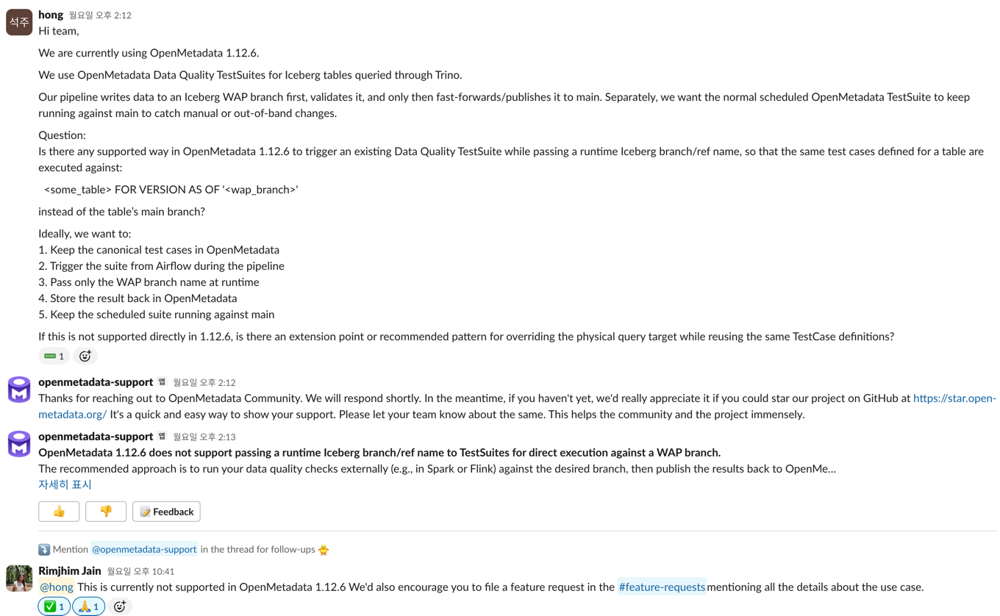

# 내가 생각한 이상적인 DQ 흐름
1. 데이터 파이프라인에서의 DQ
  - source -> transfer -> 검증 branch 쓰기 작업 (write) -> OpenMetadata 에서 해당 테이블에 대한 DQ 를 가져와서 수행 (audit) -> 검증 branch를 main branch에 merge
2. 스케줄에 따른 source of trust 내 테이블들에 대한 주기적인 DQ
  - OMD에 테이블에 대한 DQ를 스케줄링 가능하다. 데이터 파이프라인 외에도 수기 작업등에서의 오류를 검출하는 것이 목적

# WAP 적용을 고민한 이유
1. 테이블 A에 데이터가 publish 되고 난 뒤에 DQ가 돌면 다운스트림이나 해당 테이블을 보는 소비자(분석가, 마케터 등)은 잘못된 데이터를 보게된다.
2. 사내 OLAP 환경이 Iceberg 라 WAP를 위한 branch 기능이 제공되어 적용이 상대적으로 용이하다.
3. 파이프라인에서 증분 데이터에 대한 DQ만 수행하는 방법도 있지만 이러면 demention dq? 가 안된다.
4. 파이프라인에서 DQ를 수행하면 DQ 로직, 쿼리가 파편화된다.

# OpenMetadata에서 DQ를 관리하고싶은 이유
1. 이미 데이터 리니지, 데이터 사전, 데이터 탐색을 OMD에서 하고있다. 데이터의 전반적인 관리를 OMD 안에서 끝내고싶음 
2. OpenMetadata는 DQ를 UI에서 간단하게 추가 가능하다. 데이터 엔지니어뿐 아니라 데이터 분석가등 소비자에 의해서도 DQ를 추가할 수 있다.
3. OMD는 Table suite로 Test Cases를 묶을 수 있다. Table suite에 test case를 추가하면 각 데이터 파이프라인에서 WAP 과정 중에 추가된 test case도 DQ를 한다.

# 문제점
1. OpenMetadata 내의 스케줄러를 활용해 DQ를 실행하려면 sqlalchemy 로 실행 가능해야한다. (Iceberg 테이블은 OMD에 Trino 나 Athena 같은 쿼리 엔진으로 등록하면 해결 가능하다.)
2. OMD 의 DQ를 실행은 pandas dataframe으로도 가능한데, iceberg + wap에는 해당되지 않는다.
3. OMD는 OMD에 등록된 테이블에 대해서 DQ를 해주지만 해당 테이블의 branch는 DQ 대상이 아니다.

# 해결 방안
1. 파이프라인에서 OMD에서 OMD test case의 sql를 받아오고 해당 sql의 테이블만 branch로 바꿔서 DQ를 수행한다.

# 추가로 시도할만한 것
1. OMD는 DQ를 REST API로 호출하여 실행을 트리거 할 수 있는데, 이때 branch를 넘겨 DQ를 수행하도록 OMD 기능을 추가한다. 또는 추가 요청

# 유의사항
1branch 없이 쓰기를 했을때보다 WAP를 하면 branch 분기 -> merge 과정에서 Iceberg 테이블 쓰기 충돌이 일어날 확률이 조금 더 커진다. 그냥 쓰기는 dq를 하고나서 쓰기 쿼리에 대해서만 충돌이 안나면 되는데 WAP 는 branch 에 쓴 뒤 DQ를 기다리고 merge할때 기존 main이 그대로 있어야한다. 
